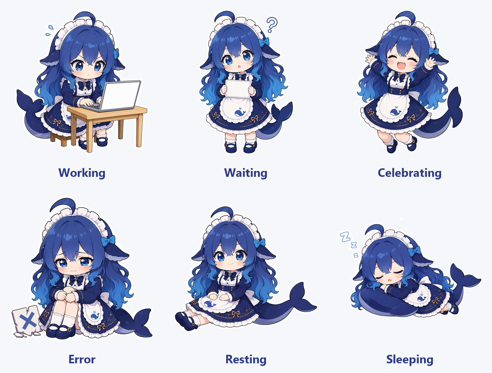

# Whale-Chan Companion

**Your little whale-chan buddy for work, wins, and well-earned naps.**



*Character state overview. The character artwork is AI-generated; see the [artwork notice](#artwork-is-ai-generated).*

A little companion that lives inside your DeepSeek Harness (DSH) window—there while you work, wait, and rest.

一只住在 DSH 窗口里的小鲸鱼娘。陪你工作、等你决定，也陪你好好打个盹。

**中文说明见 [README.zh-CN.md](README.zh-CN.md).**

This is a fork of [dsh-plugin-whale-pet](https://github.com/Yifffan/dsh-plugin-whale-pet) with
AI-generated character artwork and an independent plugin identity, so it can run beside the upstream
plugin instead of replacing it. The companion behaviour—state machine, Host turn-boundary bridge,
thought bubble, settings panel—is upstream's code, unchanged.

## What this fork changes

| | Upstream | This fork |
|---|---|---|
| Package | `dsh-plugin-whale-pet` | `dsh-plugin-whale-chan-pet` |
| Entry ID | `whale-pet` | `whale-chan-pet` |
| Host service + remote namespace | `whalePet` | `whaleChan` |
| Overlay occupant in `shell.overlay` | `whale-pet` | `whale-chan-pet` |
| Stored preferences | `dsh-plugin-whale-pet:v1` | `dsh-plugin-whale-chan-pet:v1` |

1. **Character artwork replaced.** All six state images, the plugin-manager icon, and the documentation
   overview are new illustrations generated with an AI image model from an openly published character
   setting (MIT-licensed, sourced from the internet). The upstream whale stickers are not redistributed
   here. The upstream flat-vector whale and this raster illustration therefore look different at the same
   size; see [Known limitations](#known-limitations-and-deferred-work).
2. **Independent identity.** Package name, entry ID, Host service, Typert namespace, overlay ID, and
   preference key are all distinct from upstream, so both plugins can be installed at once without
   fighting over a service name, an overlay cell, or stored preferences.
3. **Rendering tuned for raster artwork.** The default size is 125% (a portrait illustration needs more
   pixels than the upstream flat vector to read at the same visual weight); the `working` state no longer
   locks the art box to the counter's original 116×89 space, which gives the illustration about 12% more
   width; the working-session count is re-anchored onto the laptop screen measured from the shipped
   artwork; and every state animation is a whole-pixel translation, because compositing a rotated or
   scaled layer resamples its cached raster and softens the illustration. The default position is the
   upstream one, so it lands in the same corner.
4. **Asset pipeline.** `tools/build.mjs` now validates and inlines 8-bit RGBA PNG assets
   (`data:image/png;base64`) instead of validated SVG. `tools/prepare-assets.mjs` reproduces the shipped
   artwork from raw generator output, and `tools/render-state-overview.ps1` renders the overview above.
5. **Licensing documents.** `ASSETS-LICENSE.md` is an AI-artwork notice; the artwork section below,
   localization metadata, and tests follow the new identity and format.
   `node --test tests/*.test.mjs` passes 187/187.

## Artwork is AI-generated

The character assets in this repository—the six state images in `assets/`, the plugin icon
`assets/icon.png`, and `docs/images/whale-chan-states.png`—are **AI-generated** illustrations rendered
from an openly published, MIT-licensed character setting. The setting's own notice applies to the design;
the rendered images are not covered by the MIT code license.

Everything inherited from the upstream project keeps the upstream project's own terms; see
[ASSETS-LICENSE.md](ASSETS-LICENSE.md) for the full notice and [FONT-LICENSES.md](FONT-LICENSES.md) for
the unchanged bundled bubble fonts.

## Features

- Drag, resize, hide, and restore your companion inside the DSH window.
- Choose **All sessions** or **Current session**, with a working-session count for ordinary main sessions.
- Six character states: resting, working, waiting, celebrating, sleeping, and error.
- A custom icon in the DSH plugin manager.
- English and Chinese text, light and dark settings menus, and reduced-motion support.
- Separate normal completion from cancellation and failure; a falling working count or green unread
  indicator alone does not mean success.

This is an in-window plugin, not a separate operating-system desktop overlay.

## Install

### 1. GitHub

Enter this spec in DSH's plugin installation interface:

```text
github:space-spacee-clamation/dsh-plugin-whale-chan-pet
```

The repository ships prebuilt plugin files, so no build step is required to install it.

### 2. Local package directory

Build (or clone) the package anywhere on the machine running DSH and install that directory. This is how
the maintainer runs it: the profile links the working copy, so a rebuild is picked up without
reinstalling.

**Upgrading from the upstream plugin?** Entry IDs and service names differ, so upstream overrides do not
apply to this fork. `tools/entry-id-migration.mjs` plans the ID rename (`whale-pet` → `whale-chan-pet`)
for a profile patch list; review and apply the result yourself. Do not replace the plugin or restart DSH
while tasks are running.

## Usage

- **Click** the companion to say hello; **drag** it to reposition.
- **Right-click** to change session scope, size, animation, and nap timing.
- Use the restore button to bring back a hidden companion.
- Global scope covers ordinary main sessions on the currently connected Host—not multiple devices or Hosts.
- Waiting for user input has higher display priority. Brief completion notices are not queued for later
  replay.

## Compatibility and behavior

- Inherited from upstream, which was originally developed for **DSH Desktop 0.1.6-alpha.2 on macOS
  arm64**. DSH is still evolving; other version/platform combinations are not universally certified.
- This fork has been exercised in a **DSH Web profile on Windows**: the overlay occupant registers beside
  the upstream whale, all six states render, and the working-session count lands on the laptop screen.
  That is maintainer-observed rendering evidence, not an exhaustive test matrix.
- Completion uses live normal turn-end events. Intermediate assistant/tool messages, cancellation,
  disconnected history and work-count changes are not treated as successful completion.
- The offline preview simulates completion; it validates rendering, not delivery of live DSH events.

## Development

Use Node.js 22 or newer and the pnpm version pinned in the project manifest.

```sh
node tools/build.mjs                  # regenerate lib/client.js and preview/index.html
node --test tests/*.test.mjs          # 187 tests
```

Asset work (regenerating art from image-model output):

```sh
node tools/prepare-assets.mjs --src <generator-output-dir> --long 560 --sharpen 0.7
node tools/prepare-assets.mjs --icon waiting          # cut the plugin-manager icon
node tools/prepare-assets.mjs --measure working       # locate the laptop screen for the count anchor
```

`prepare-assets.mjs` removes the checkerboard background the image model paints instead of writing an
alpha channel, keeps genuinely white artwork (laptop screen, whiteboard, card, apron) by testing whether
an enclosed region mixes both checkerboard tones, redraws a uniform white sticker ring, crops to the
artwork, resamples with Lanczos-3, applies an unsharp mask, and encodes RGBA PNG. `--measure` reports the
largest flat bright region so the working-session count can be anchored to the illustration.

The documentation overview is rendered from the shipped assets:

```powershell
pwsh -File tools/render-state-overview.ps1     # Windows, System.Drawing
```

`pnpm run build` additionally regenerates the bridge contract (esbuild + zod) before the client bundle;
asset-only changes do not need it. Prebuilt files are committed for Git installation, so rebuild and
commit matching outputs after a source change.

## Privacy and runtime boundaries

- Does not modify DSH itself, send model messages, add model inference calls, or act on approvals for you.
- Uses DSH's existing authenticated connection. No additional listening port, telemetry, or runtime
  font/CDN requests.
- The completion bridge projects only necessary session identity and turn-boundary metadata—not chat
  content.
- Preferences stay in client-local storage. No runtime diagnostic report, diagnostic counters or
  diagnostic query endpoint is included in this release.
- Tests use synthetic data. This repository contains no user profiles, session records, or extracted DSH
  implementation code.

## Known limitations and deferred work

- **Raster versus vector.** The upstream whale is a flat vector sticker and stays crisp at any size. This
  fork's artwork is a rendered illustration with gradients and thin lines, so it is softer at small sizes
  and needs roughly 125% size to carry the same visual weight. Raising the size slider sharpens it
  further; vector tracing the illustrations is the only way to match vector crispness exactly.
- **Artwork regeneration must go through the tool.** The image model paints a fake transparency
  checkerboard instead of writing alpha; dropping raw generator output into `assets/` would ship that
  checkerboard. Always run `tools/prepare-assets.mjs`.
- **Upstream verification claims carry over unchanged.** Races around concurrent sessions, reconnects,
  cancellation, and upgrades were verified by the upstream author to the extent described in
  [COMPATIBILITY.md](COMPATIBILITY.md); this fork has not re-run that matrix.

## Credits and licensing

- **Code:** [MIT License](LICENSE), forked from
  [Yifffan/dsh-plugin-whale-pet](https://github.com/Yifffan/dsh-plugin-whale-pet); the original copyright
  notice is retained.
- **Character setting:** openly published on the internet under the MIT license; its notice applies to
  the design.
- **Character artwork:** AI-generated from that setting, separate from the MIT code license—see
  [ASSETS-LICENSE.md](ASSETS-LICENSE.md).
- **Fonts:** unchanged from upstream, [SIL OFL 1.1 and source notices](FONT-LICENSES.md).
- **Zod:** its MIT copyright and license notice are preserved in the generated bridge files.

This is a personal project, not an official DeepSeek product. It does not represent DeepSeek's official
views or endorsement.
